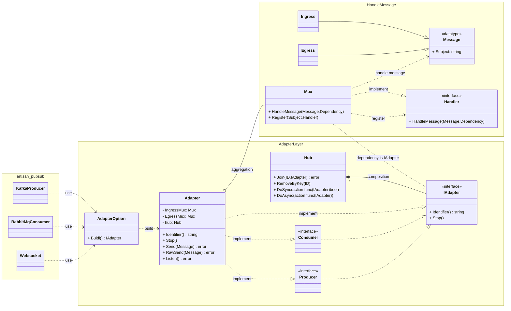

# ART（Advanced Routing Technology）

[中文 zh-tw](README_ch.md)

- [Introduction](#introduction)
- [Setup](#setup)
  - [Prerequisites](#prerequisites)
  - [Installation](#installation)
- [Features](#features)
- [Example](#example)
  - [Simple Scenario](#simple-scenario)
  - [Advanced Scenario](#advanced-scenario)
- [Class Diagram](#class-diagram)

## Introduction

`ART` is a flexible message router (Mux) designed to handle message streams, allowing developers to customize message processing and subject configuration according to specific needs.

Similar to the `Watermill`, `ART` can be used to integrate various 3rd pub/sub packages. However, unlike `Watermill`, `ART` separates the application layer's logic processing from the infrastructure, retaining the core functionality provided by 3rd packages. It focuses on application-layer logic processing and provides Middleware mechanisms.

Whether building event-driven systems, or any application requiring message delivery, `ART` provides excellent support.

The project is divided into several parts:

- **Mux:** Forms the core of message processing, providing features such as routing definitions, routing group, message handling, and middleware support.

- **Adapter:** Integrates with 3rd pub/sub packages to produce message, consume message, and connection lifecycle management.

## Setup

### Prerequisites

- `Go 1.20+` installed.
- Ensure that `$GOBIN` (Go binary path) is in the system's PATH.

### Installation

1. Install the Go package:
    ```bash
    go get -u github.com/KScaesar/art
    ```

2. Install the code generation command:
    ```bash
    go install github.com/KScaesar/art/cmd/art@latest
    ```

## Features

1. **Flexible Routing Definitions**:
      - Supports defining routes based on numbers or strings and route parameters to adapt to various scenarios. For example, defining a route as `/users/{id}` will get the `id`=`1017` when receiving the `/users/1017` message.
      - Provides `DefaultHandler` and `NotFoundHandler` to ensure graceful handling and response even when no matching route is found.
      - Provides `Transform` functionality to perform route transformation during the route matching process. For example, decode in Websockets to obtain the topic, or extract secondary topic from payloads in other communication protocols.

2. **Middleware Support**:
      - `PreMiddleware` and `PostMiddleware`: Supports adding middleware before and after processing functions to implement flexible processing logic.
      - `Link` can chain multiple middleware and processing functions together to implement complex processing flows.
      - Provides common utilities such as UseRetry, UseRecover, UseLogger, UseExclude, UsePrintResult, facilitating message processing and monitoring.

3. **Group Component**:
      - Allows developers to organize related routes and handlers together using the Group feature, improving code readability and manageability. The Group feature utilizes trie data structures to implement route lookup and management.

4. **Adapter**:
      - Integrates with 3rd pub/sub packages, allowing sending and receiving messages while retaining the core functionality provided by 3rd packages.
      - The `Hub` can add and remove adapters based on specific filtering criteria or perform specific actions on adapters. For example, specifying user ID for WebSocket message push.
      - Supports message Ping-Pong mechanism and automatic reconnection to improve reliability, but this depends on the implementation of each 3rd package.
      - `Shutdown` and `Stop`provide a unified method to close the Adapter, especially when the application needs to gracefully shutdown upon receiving OS signals.
      - When developers need to integrate with 3rd pub/sub packages, they can use the CLI gen code to generate code templates to accelerate the development process.

## Example

### Simple Scenario

[ref](./example/main.go)

[Go Playground
](https://go.dev/play/p/PToPsy82RHf)

```go
package main

func main() {
  art.SetDefaultLogger(art.NewLogger(false, art.LogLevelDebug))

  routeDelimiter := "/"
  mux := art.NewMux(routeDelimiter)

  mux.ErrorHandler(art.UsePrintResult{}.PrintIngress().PostMiddleware())

  // Note:
  // Before registering handler, middleware must be defined;
  // otherwise, the handler won't be able to use middleware.
  mux.Middleware(
    art.UseRecover(),
    art.UsePrintDetail().
      Link(art.UseExclude([]string{"RegisterUser"})).
      PostMiddleware(),
    art.UseLogger(true, art.SafeConcurrency_Skip),
    art.UseHowMuchTime(),
    art.UseAdHocFunc(func(message *art.Message, dep any) error {
      logger := art.CtxGetLogger(message.Ctx, dep)
      logger.Info("    >> recv %q <<", message.Subject)
      return nil
    }).PreMiddleware(),
  )

  // When a subject cannot be found, execute the 'Default'
  mux.DefaultHandler(art.UseSkipMessage())

  v1 := mux.Group("v1/").Middleware(HandleAuth().PreMiddleware())

  v1.Handler("Hello/{user}", Hello)

  db := make(map[string]any)
  v1.Handler("UpdatedProductPrice/{brand}", UpdatedProductPrice(db))

  // Endpoints:
  // [art] subject=".*"                                f="main.main.UseSkipMessage.func11"
  // [art] subject="v1/Hello/{user}"                   f="main.Hello"
  // [art] subject="v1/UpdatedProductPrice/{brand}"    f="main.main.UpdatedProductPrice.func14"
  mux.Endpoints(func(subject, fn string) { fmt.Printf("[art] subject=%-35q f=%q\n", subject, fn) })

  intervalSecond := 2
  Listen(mux, intervalSecond)
}
```

### Advanced Scenario

Use the `art gen` command to generate code templates for quick integration with 3rd pub/sub packages.

After generating the code templates, you can modify the template content according to your requirements. Choose between Prosumer, Producer, or Consumer, and delete any unused code.

```
art -h

help: 
    art gen -dir  ./    -pkg  infra    -f  kafka 
    art gen -dir {Path} -pkg {Package} -f {File} 

-dir  Generate code to dir
-f    File prefix name
-pkg  Package name
```

- [artisan](https://github.com/KScaesar/artisan?tab=readme-ov-file#art-adapter)
  - [SSE: Producer Example](https://github.com/KScaesar/artisan?tab=readme-ov-file#sse)
  - [Rabbitmq: Producer Consumer Example](https://github.com/KScaesar/artisan?tab=readme-ov-file#rabbitmq)
  - Kafka: Producer Consumer Example
    - [Kafka Adapter](https://github.com/KScaesar/GARMIN2024/blob/main/pkg/kafka_adapter.go#L87-L146)
    - [Kafka Producer](https://github.com/KScaesar/GARMIN2024/blob/main/pkg/adapters/pubsub/kafka_producer.go)
    - [Kafka Consumer](https://github.com/KScaesar/GARMIN2024/blob/main/pkg/adapters/pubsub/kafka_consumer.go)
      
## Class Diagram


