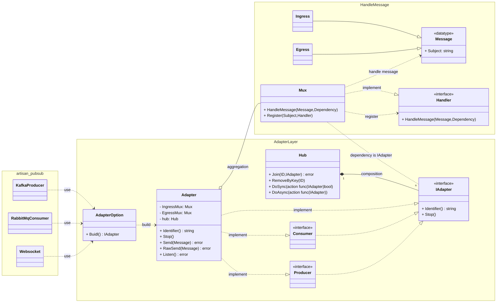

# ART（Advanced Routing Technology）

[English](README.md)

- [Introduction](#introduction)
- [Setup](#setup)
    - [Prerequisites](#prerequisites)
    - [Installation](#installation)
- [Features](#features)
- [Example](#example)
    - [Simple Scenario](#simple-scenario)
    - [Advanced Scenario](#advanced-scenario)
- [Class Diagram](#class-diagram)

## Introduction

`ART` 是一個彈性的訊息路由器（Mux），旨在處理訊息流，讓開發者能根據特定需求自訂訊息處理和 Subject 配置。

類似 `Watermill`，`ART` 可用於整合各種第三方 pub/sub 套件。但與 `Watermill` 不同，`ART` 將應用程式層的邏輯處理與基礎設施分離，保留第三方套件提供的核心功能。它專注於應用程式層的邏輯處理，並提供 Middleware 機制。

無論是構建事件驅動系統還是任何需要訊息傳遞的應用程式，`ART` 都提供了出色的支援。

該專案分為幾個部分：

- **Mux：** 構成訊息處理的核心，提供路由定義、路由群組、訊息處理和 Middleware 支援等功能。

- **Adapter：** 與第三方 pub/sub 套件整合，用於產生訊息、消費訊息和連線生命週期管理。

## Setup

### Prerequisites

- 已安裝 `Go 1.20+`。
- 確保 `$GOBIN`（Go 二進位檔案路徑）已新增至系統的 PATH 中。

### Installation

1. 安裝 Go 套件：
    ```bash
    go get -u github.com/KScaesar/art
    ```

2. 安裝 code generation 命令：
    ```bash
    go install github.com/KScaesar/art/cmd/art@latest
    ```

## Features

1. **彈性的路由定義**：
    - 支援基於數字或字串定義路由，並支援路由參數，以適應各種情境。例如，將路由定義為 `/users/{id}`，當接收到 `/users/1017` 訊息時，得到 `id` 參數為 `1017`。
    - 提供 `DefaultHandler` 和 `NotFoundHandler`，確保即使找不到匹配的路由，仍能優雅地處理和回應。
    - 提供 `Transform` 功能，在路由匹配過程中進行路由轉換，例如在 Websockets 進行 decode 以獲取 Topic ，或從其他通訊協定的 payload 中得到 secondary topic。

2. ** Middleware 支援**：
    - `PreMiddleware` 和 `PostMiddleware`：支援在處理函式之前和之後添加 Middleware ，實現彈性的處理邏輯。
    - `Link` 可以將多個 Middleware 和處理函式鏈在一起，實現複雜的處理流程。
    - 提供常見的實用程式，如 UseRetry、UseRecover、UseLogger、UseExclude、UsePrintResult，方便訊息處理和監控。

3. **Group Component**：
    - 允許開發者使用 Group 功能將相關路由和處理程序組織在一起，提高程式碼的可讀性和可管理性。Group 功能利用 trie tree 數據結構實現路由查找和管理。

4. **Adapter：**
    - 與第三方 pub/sub 套件整合，允許發送和接收訊息，並保留第三方套件提供的核心功能。
    - `Hub` 提供了根據特定篩選條件添加和移除或是對 Adapter 進行特定行動，使管理更加靈活。例如，指定使用者 ID 的 Websocket 推送訊息。
    - 支援訊息 Ping-Pong 機制和自動重新連線，以提高可靠性，但這取決於每個第三方套件的實現。
    - `Shutdown` 和 `Stop` 提供了統一的方法來關閉 Adapter，特別是當應用程式需要在接收 OS signals 時優雅地關閉。
    - 當開發人員需要與第三方 pub/sub 套件整合時，可以使用 CLI 生成程式碼 template，加快開發過程。

## Example


### Simple Scenario

[ref](./example/main.go)

[Go Playground
](https://go.dev/play/p/_E5wrg609Q0)

```go
package main

func main() {
  art.SetDefaultLogger(art.NewLogger(false, art.LogLevelDebug))

  routeDelimiter := "/"
  mux := art.NewMux(routeDelimiter)

  mux.ErrorHandler(art.UsePrintResult{}.PrintIngress().PostMiddleware())

  // Note:
  // Before registering handler, middleware must be defined;
  // otherwise, the handler won't be able to use middleware.
  mux.Middleware(
    art.UseRecover(),
    art.UsePrintDetail().
      Link(art.UseExclude([]string{"RegisterUser"})).
      PostMiddleware(),
    art.UseLogger(true, art.SafeConcurrency_Skip),
    art.UseHowMuchTime(),
    art.UseAdHocFunc(func(message *art.Message, dep any) error {
      logger := art.CtxGetLogger(message.Ctx, dep)
      logger.Info("    >> recv %q <<", message.Subject)
      return nil
    }).PreMiddleware(),
  )

  // When a subject cannot be found, execute the 'Default'
  mux.DefaultHandler(art.UseSkipMessage())

  v1 := mux.Group("v1/").Middleware(HandleAuth().PreMiddleware())

  v1.Handler("Hello/{user}", Hello)

  db := make(map[string]any)
  v1.Handler("UpdatedProductPrice/{brand}", UpdatedProductPrice(db))

  // Endpoints:
  // [art] subject=".*"                                f="main.main.UseSkipMessage.func11"
  // [art] subject="v1/Hello/{user}"                   f="main.Hello"
  // [art] subject="v1/UpdatedProductPrice/{brand}"    f="main.main.UpdatedProductPrice.func14"
  mux.Endpoints(func(subject, fn string) { fmt.Printf("[art] subject=%-35q f=%q\n", subject, fn) })

  intervalSecond := 2
  Listen(mux, intervalSecond)
}
```

### Advanced Scenario

使用 `art gen` 命令來產生程式碼 template 藉此快速整合 3rd pub/sub 套件。

產生程式碼 template 後，您可以根據需求修改 template 內容。選擇 Prosumer、Producer 或 Consumer，並刪除任何未使用的程式碼。

```
art -h

help: 
    art gen -dir  ./    -pkg  infra    -f  kafka 
    art gen -dir {Path} -pkg {Package} -f {File} 

-dir  Generate code to dir
-f    File prefix name
-pkg  Package name
```

- [artisan](https://github.com/KScaesar/artisan?tab=readme-ov-file#art-adapter)
    - [SSE: Producer Example](https://github.com/KScaesar/artisan?tab=readme-ov-file#sse)
    - [Rabbitmq: Producer Consumer Example](https://github.com/KScaesar/artisan?tab=readme-ov-file#rabbitmq)
    - Kafka: Producer Consumer Example
        - [Kafka Adapter](https://github.com/KScaesar/GARMIN2024/blob/main/pkg/kafka_adapter.go#L87-L146)
        - [Kafka Producer](https://github.com/KScaesar/GARMIN2024/blob/main/pkg/adapters/pubsub/kafka_producer.go)
        - [Kafka Consumer](https://github.com/KScaesar/GARMIN2024/blob/main/pkg/adapters/pubsub/kafka_consumer.go)

## Class Diagram


